# Atlas Engineering OS

> **The Engineering Operating System for the AI Era**
> *Transform ideas into world-class software through intelligent orchestration, persistent memory, and living architecture.*

---

[](LICENSE)
[]()
[]()
[](docs/)
[](foundation/manifesto/MANIFESTO.md)
[]()

---

## What is Atlas?

**Atlas is an Engineering Operating System** — not another tool, not another framework, not another AI wrapper. Atlas is the substrate on which great software is conceived, designed, governed, built, and evolved.

Where other tools automate tasks, Atlas **orchestrates intelligence**. Where other platforms assist developers, Atlas **partners with them**. Where other systems generate code, Atlas **generates understanding** — blueprints, constitutions, architectural decisions, security postures, and the persistent memory of every decision ever made about your software.

Atlas answers a question that no tool has ever properly answered:

> *"How do we build software that is not just functional, but truly excellent — at the speed of AI, with the wisdom of great engineering?"*

The answer is an Engineering Operating System: a persistent, intelligent, multi-agent layer that sits between human intent and running software — transforming the former into the latter through disciplined, principled, documented engineering.

---

## The Problem Atlas Solves

Modern software development has a crisis of **institutional amnesia**. Teams grow, decisions are forgotten, context is lost, technical debt accumulates silently, and the gap between "what we intended to build" and "what we actually built" widens over years until the system becomes incomprehensible to everyone who touches it.

AI has not solved this. It has accelerated it. The ability to generate code at machine speed, without the discipline to govern, document, and evolve it properly, produces faster technical debt, not better software.

Atlas was built to solve three fundamental problems:

| Problem | Current State | Atlas Solution |
|---------|--------------|----------------|
| **Context Loss** | Decisions live in Slack, email, and heads | Persistent memory layer with ADRs, decisions, rationale |
| **Quality Drift** | Quality degrades silently over time | Continuous Engineering Score with automated enforcement |
| **AI Governance** | AI generates code without architectural awareness | Multi-agent orchestration under constitutional governance |

---

## Architecture Overview

```mermaid
flowchart TD
    %% Styling and Theme (Obsidian & Machined Glass theme visual representation)
    classDef layerFill fill:#0f0f0f,stroke:#00F5FF,stroke-width:2px,color:#fff;
    classDef nodeFill fill:#1a1a1a,stroke:#333,stroke-width:1px,color:#ddd;
    classDef highlight fill:#1f1f1f,stroke:#10B981,stroke-width:2px,color:#fff;

    subgraph HIL ["HUMAN INTERFACE LAYER"]
        CLI["CLI (agy)"]
        IDE["IDE Plugin"]
        Web["Web Dashboard"]
        API["API & Webhooks"]
    end

    subgraph OGL ["ORCHESTRATION & GOVERNANCE LAYER"]
        Const["Constitution Engine"]
        Blue["Blueprint Engine"]
        Orch["Agent Orchestrator (Multi-Agent Core)"]
    end

    subgraph IL ["INTELLIGENCE LAYER"]
        Req["Requirement Discovery Engine"]
        Mem["Memory Engine"]
        Dec["Decision Engine (ADRs)"]
        Audit["Audit Engine (Red Team + Simulation)"]
    end

    subgraph KL ["KNOWLEDGE LAYER"]
        Docs["Living Docs Engine"]
        MCP["MCP Discovery Engine"]
        Score["Engineering Score Engine"]
        PMem["Project Memory"]
    end

    subgraph FL ["FOUNDATION LAYER"]
        Vision["Vision"]
        Manifesto["Manifesto"]
        Constitution["Constitution"]
        Values["Values"]
        Principles["Principles"]
    end

    %% Flows
    HIL --> OGL
    OGL --> IL
    IL --> KL
    KL --> FL

    %% Apply Styles
    class HIL,OGL,IL,KL,FL layerFill;
    class CLI,IDE,Web,API,Const,Blue,Orch,Req,Mem,Dec,Audit,Docs,MCP,Score,PMem,Vision,Manifesto,Constitution,Values,Principles nodeFill;
    class Orch,Blue,Score highlight;
```



---

## Core Capabilities

Atlas is composed of **15 interconnected engines and modules**, each purpose-built and deeply integrated:

### 🔍 1. Requirement Discovery Engine
The intelligent intake layer. Atlas conducts structured Socratic dialogue with stakeholders to surface not just *what* they want, but *why* they want it, what constraints apply, and what they haven't thought of yet. Produces structured requirement documents that feed every downstream engine.

### 🏗️ 2. Blueprint Engine
The architectural heart of Atlas. Blueprints are living, versioned architectural specifications — more than diagrams, less than code. A Blueprint defines system topology, component contracts, data flows, integration patterns, and the reasoning behind every structural decision. Blueprint-First is a core Atlas mandate.

### ⚖️ 3. Constitution Engine
Every Atlas project has a Constitution: a governance document that defines the inviolable rules of the system. The Constitution Engine generates, validates, and enforces constitutional constraints across all agents, code, and architectural decisions. No agent can violate the Constitution.

### 🧠 4. Agent Orchestrator
The multi-agent coordination core. Atlas orchestrates specialized AI agents — each with defined roles, authorities, and limitations — to perform complex engineering tasks in parallel. The Orchestrator manages agent lifecycles, resolves conflicts, aggregates outputs, and ensures no single agent acts unilaterally on critical decisions.

### 💾 5. Project Memory Engine
Persistent, structured memory for every project. Not just git history — architectural memory. The Memory Engine stores decisions, rationale, context, team knowledge, past failures, and lessons learned in a queryable, evolving knowledge graph. Memory persists across teams and time.

### 📋 6. ADR Engine (Architectural Decision Records)
Automated generation, tracking, and enforcement of Architectural Decision Records. Every significant technical decision produces an ADR. The ADR Engine detects when decisions are revisited, surfaces relevant prior decisions, and prevents repeating historical mistakes.

### 📚 7. Living Documentation Engine
Documentation that evolves with the code. The Living Docs Engine generates, maintains, and validates documentation by continuously analyzing the actual system state. No more stale docs — Atlas ensures documentation reflects reality, or flags the discrepancy.

### 🔎 8. MCP Discovery Engine
Automated discovery and evaluation of Model Context Protocol (MCP) tools, APIs, and integrations. Atlas scans the ecosystem, evaluates fitness for project needs, generates integration recommendations, and auto-configures approved tools within constitutional boundaries.

### 🎯 9. Technical Audit Engine
Deep, structured technical audits of any codebase or system. The Audit Engine evaluates architecture, security posture, code quality, dependency health, performance characteristics, and alignment with the project Constitution. Produces actionable Engineering Score reports.

### 🔴 10. Red Team Engine
Adversarial evaluation of systems. The Red Team Engine simulates attack scenarios, identifies security vulnerabilities, stress-tests architectural assumptions, and evaluates failure modes — all before code ships. Red Team findings feed directly into the Constitution and ADRs.

### 🎮 11. Simulation Engine
Run your architecture before you build it. The Simulation Engine models system behavior under various load, failure, and edge-case scenarios using formal specification techniques. Identifies bottlenecks, race conditions, and architectural flaws in simulation, not production.

### 📊 12. Engineering Score Engine
A continuous, multi-dimensional quality metric for every project. The Engineering Score evaluates architecture quality, documentation completeness, test coverage, security posture, technical debt, and constitutional compliance — providing a single, honest, evolving measure of software excellence.

### 🔐 13. Security Engine
Security as a first-class architectural concern, not an afterthought. The Security Engine generates threat models, enforces security patterns, validates cryptographic choices, audits dependency vulnerabilities, and continuously monitors for security drift.

### 🔄 14. Evolution Engine
Systems must evolve. The Evolution Engine tracks system health over time, identifies when components need refactoring, proposes evolutionary paths, and orchestrates incremental migrations — ensuring Atlas projects never accrete unmanageable technical debt.

### 🗂️ 15. Project Orchestration Layer
The meta-layer that ties everything together. Manages project lifecycle phases (Discovery → Blueprint → Build → Audit → Evolve), coordinates cross-engine workflows, manages state transitions, and provides the unified view of project health and progress.

---

## Technology Philosophy

Atlas is built on five irreducible philosophical commitments:

### 1. Blueprint-First, Always
No code is written without a Blueprint. No Blueprint is written without requirements. No requirements are accepted without validation. This is the Atlas sequence, and it is inviolable. The Blueprint is the source of truth; the code is its expression.

### 2. Constitutional Governance
Every system has inviolable rules. Atlas makes them explicit, machine-readable, and enforced. The Constitution is not a suggestion — it is a constraint that every agent, every tool, and every human contributor must respect.

### 3. Memory Over Amnesia
Every decision, every rationale, every lesson learned is preserved. Atlas treats institutional knowledge as a first-class system asset, not an afterthought. Future teams must be able to understand why — not just what.

### 4. Adversarial Honesty
Atlas tells the truth about your system, even when the truth is uncomfortable. The Engineering Score is honest. Red Team findings are unfiltered. Audit results are complete. Atlas is not in the business of flattering developers — it is in the business of building excellent software.

### 5. Human Sovereignty
AI augments human judgment; it does not replace it. Atlas's agents have defined authorities and hard limits. Critical architectural decisions require human review. The Constitution guarantees human control over every significant system behavior.

---

## Repository Structure

```
atlas/
├── README.md                          # This file — the north star
├── CHANGELOG.md                       # Version history
├── LICENSE                            # MIT License
│
├── foundation/                        # Philosophical and governance foundation
│   ├── vision/
│   │   └── VISION.md                  # 2030 product vision
│   ├── manifesto/
│   │   └── MANIFESTO.md               # Engineering manifesto
│   ├── constitution/
│   │   └── CONSTITUTION.md            # System constitution
│   ├── values/
│   │   └── VALUES.md                  # Core values
│   └── principles/
│       └── ENGINEERING_PRINCIPLES.md  # Engineering principles
│
├── architecture/                      # System architecture docs
│   ├── ADRs/                          # Architectural Decision Records
│   ├── blueprints/                    # System blueprints
│   ├── diagrams/                      # Architecture diagrams
│   └── ARCHITECTURE.md               # Architecture overview
│
├── engines/                           # Core engine specifications
│   ├── requirement-discovery/
│   ├── blueprint/
│   ├── constitution/
│   ├── orchestrator/
│   ├── memory/
│   ├── adr/
│   ├── living-docs/
│   ├── mcp-discovery/
│   ├── audit/
│   ├── red-team/
│   ├── simulation/
│   ├── engineering-score/
│   ├── security/
│   ├── evolution/
│   └── project-orchestration/
│
├── protocols/                         # Inter-agent communication protocols
│   ├── agent-contracts/
│   ├── message-schemas/
│   └── governance/
│
├── docs/                              # User-facing documentation
│   ├── getting-started/
│   ├── guides/
│   ├── reference/
│   ├── tutorials/
│   └── api/
│
├── research/                          # Research and exploration
│   ├── papers/
│   ├── experiments/
│   └── benchmarks/
│
└── tools/                             # Development tools
    ├── scripts/
    ├── templates/
    └── validators/
```

---

## Getting Started

Atlas operates in four phases, regardless of whether you're starting a greenfield project or analyzing an existing system:

### Phase 1: Orientation
Begin with the foundation documents. The [`VISION.md`](foundation/vision/VISION.md) tells you where Atlas is going. The [`MANIFESTO.md`](foundation/manifesto/MANIFESTO.md) tells you what Atlas believes. The [`CONSTITUTION.md`](foundation/constitution/CONSTITUTION.md) tells you the inviolable rules. Read these before anything else — they are not decorative; they are the operating system's kernel.

### Phase 2: Discovery
Every Atlas project begins with the **Requirement Discovery Engine**. No assumptions, no skipped steps. Atlas engages with stakeholders through structured dialogue to produce a complete requirements artifact — one that captures functional requirements, non-functional requirements, constraints, risks, and the *why* behind every decision.

### Phase 3: Blueprint
Once requirements are validated, the **Blueprint Engine** produces the architectural specification. The Blueprint is reviewed, iterated, and approved before any implementation begins. The Blueprint, once approved, becomes the ground truth from which the Constitution is derived.

### Phase 4: Build, Audit, Evolve
With Blueprint and Constitution in place, the **Agent Orchestrator** coordinates implementation agents. The **Technical Audit Engine** runs continuously. The **Engineering Score** tracks quality. The **Living Docs Engine** keeps documentation aligned with reality. The system evolves under the governance of its Constitution.

---

## Documentation Index

| Document | Purpose | Status |
|----------|---------|--------|
| [VISION.md](foundation/vision/VISION.md) | 2030 product vision and mission | ✅ Complete |
| [MANIFESTO.md](foundation/manifesto/MANIFESTO.md) | Engineering philosophy and principles | ✅ Complete |
| [CONSTITUTION.md](foundation/constitution/CONSTITUTION.md) | System governance and invariants | ✅ Complete |
| [VALUES.md](foundation/values/VALUES.md) | Core values and trade-off framework | ✅ Complete |
| [ENGINEERING_PRINCIPLES.md](foundation/principles/ENGINEERING_PRINCIPLES.md) | Technical engineering principles | ✅ Complete |
| [ARCHITECTURE.md](architecture/ARCHITECTURE.md) | System architecture overview | 🚧 In Progress |
| Engine Specifications | Per-engine design docs | 🚧 In Progress |
| API Reference | Complete API documentation | 📋 Planned |
| Getting Started Guide | Step-by-step onboarding | 📋 Planned |
| Tutorial: First Blueprint | End-to-end walkthrough | 📋 Planned |

---

## Core Principles at a Glance

Atlas engineering is governed by **20+ principles** (see [`ENGINEERING_PRINCIPLES.md`](foundation/principles/ENGINEERING_PRINCIPLES.md)) organized across six domains:

- **Architecture**: Blueprint-First, Explicit Over Implicit, Separation of Concerns, Constitutional Boundaries
- **Data**: Data Sovereignty, Schema-First, Immutability as Default, Lineage Tracking
- **Security**: Zero-Trust by Default, Least Privilege Always, Cryptographic Integrity
- **AI/ML**: Bounded Agent Authority, Adversarial Testing Mandate, Human Override Guarantee
- **Quality**: Continuous Audit, Engineering Score as Truth, Documentation as Code
- **Developer Experience**: Cognitive Load Reduction, Progressive Disclosure, Honest Feedback

---

## The Atlas Promise

To every engineer who works with Atlas:

1. **Your context will be preserved.** Future teams will understand why you made every decision.
2. **Your architecture will be honest.** The Engineering Score will reflect reality, not optimism.
3. **Your system will be secure.** Security is not a feature — it is a constitutional right.
4. **Your documentation will live.** Living docs eliminate the gap between intent and reality.
5. **Your agents will be governed.** No AI agent will make unilateral architectural decisions.
6. **Your software will evolve.** Atlas will tell you when to refactor before it becomes a crisis.

---

## Contributing

Atlas is built on the belief that great software is a collective achievement. We welcome contributions that advance the mission — but contributions must align with the Atlas Constitution, Values, and Engineering Principles.

Before contributing, read:
- [`MANIFESTO.md`](foundation/manifesto/MANIFESTO.md) — understand what Atlas believes
- [`CONSTITUTION.md`](foundation/constitution/CONSTITUTION.md) — understand the inviolable rules
- [`ENGINEERING_PRINCIPLES.md`](foundation/principles/ENGINEERING_PRINCIPLES.md) — understand the technical standards

Contributing guidelines: [`CONTRIBUTING.md`](CONTRIBUTING.md) *(coming soon)*

---

## Roadmap

| Milestone | Target | Description |
|-----------|--------|-------------|
| **Foundation** | Q1 2026 | Complete foundation documents, core engine specs |
| **Blueprint Engine v1** | Q2 2026 | First working Blueprint Engine with ADR generation |
| **Memory Engine v1** | Q2 2026 | Persistent project memory with knowledge graph |
| **Audit Engine v1** | Q3 2026 | Technical audit with Engineering Score output |
| **Orchestrator v1** | Q3 2026 | Multi-agent coordination layer |
| **Red Team Engine v1** | Q4 2026 | Adversarial evaluation capability |
| **Atlas OS v0.1** | Q1 2027 | First integrated release — all engines connected |
| **Living Docs v1** | Q2 2027 | Fully automated living documentation |
| **Atlas OS v1.0** | Q4 2027 | Production-ready Engineering OS |

---

## Research Foundation

Atlas is grounded in decades of software engineering research and practice. Key intellectual foundations include:

- **Architecture Decision Records (ADRs)** — Michael Nygard's original ADR format, significantly extended
- **C4 Model** — Simon Brown's approach to software architecture documentation
- **Domain-Driven Design** — Eric Evans's foundational work on modeling complex systems
- **Team Topologies** — Skelton & Pais on cognitive load and team organization
- **The Phoenix Project / Accelerate** — DevOps research and DORA metrics
- **Thinking in Systems** — Donella Meadows's systems dynamics framework
- **A Philosophy of Software Design** — John Ousterhout on complexity management
- **Security Engineering** — Ross Anderson's comprehensive security framework

---

## License

Atlas is released under the [MIT License](LICENSE).

```
Copyright (c) 2026 Atlas Engineering OS Project

Permission is hereby granted, free of charge, to any person obtaining a copy
of this software and associated documentation files (the "Software"), to deal
in the Software without restriction, including without limitation the rights
to use, copy, modify, merge, publish, distribute, sublicense, and/or sell
copies of the Software, and to permit persons to whom the Software is
furnished to do so, subject to the following conditions:

The above copyright notice and this permission notice shall be included in all
copies or substantial portions of the Software.
```

---

## The Name

**Atlas** — the Titan who holds up the sky. In Greek mythology, Atlas bears the weight of the celestial spheres on his shoulders, ensuring they do not collapse. The Engineering Operating System bears a similar burden: holding up the architecture, the decisions, the memory, the quality standards, and the governance that prevent software systems from collapsing under their own complexity.

Atlas does not build software. Atlas holds up the sky so that builders can work beneath it.

---

*"The goal of good software design is to reduce the amount of code a programmer must read to understand a system, and to reduce the amount of thinking required to make correct changes." — John Ousterhout*

*Atlas exists to make that goal achievable at scale, across time, and in the age of artificial intelligence.*

---

<div align="center">

**[Vision](foundation/vision/VISION.md)** · **[Manifesto](foundation/manifesto/MANIFESTO.md)** · **[Constitution](foundation/constitution/CONSTITUTION.md)** · **[Values](foundation/values/VALUES.md)** · **[Principles](foundation/principles/ENGINEERING_PRINCIPLES.md)**

*Built with discipline. Governed by constitution. Evolved with intelligence.*

</div>
