```mermaid
flowchart TD
    %% Styling and Theme (Obsidian & Machined Glass theme visual representation)
    classDef layerFill fill:#0f0f0f,stroke:#00F5FF,stroke-width:2px,color:#fff;
    classDef nodeFill fill:#1a1a1a,stroke:#333,stroke-width:1px,color:#ddd;
    classDef highlight fill:#1f1f1f,stroke:#10B981,stroke-width:2px,color:#fff;

    subgraph HIL ["HUMAN INTERFACE LAYER"]
        CLI["CLI (agy)"]
        IDE["IDE Plugin"]
        Web["Web Dashboard"]
        API["API & Webhooks"]
    end

    subgraph OGL ["ORCHESTRATION & GOVERNANCE LAYER"]
        Const["Constitution Engine"]
        Blue["Blueprint Engine"]
        Orch["Agent Orchestrator (Multi-Agent Core)"]
    end

    subgraph IL ["INTELLIGENCE LAYER"]
        Req["Requirement Discovery Engine"]
        Mem["Memory Engine"]
        Dec["Decision Engine (ADRs)"]
        Audit["Audit Engine (Red Team + Simulation)"]
    end

    subgraph KL ["KNOWLEDGE LAYER"]
        Docs["Living Docs Engine"]
        MCP["MCP Discovery Engine"]
        Score["Engineering Score Engine"]
        PMem["Project Memory"]
    end

    subgraph FL ["FOUNDATION LAYER"]
        Vision["Vision"]
        Manifesto["Manifesto"]
        Constitution["Constitution"]
        Values["Values"]
        Principles["Principles"]
    end

    %% Flows
    HIL --> OGL
    OGL --> IL
    IL --> KL
    KL --> FL

    %% Apply Styles
    class HIL,OGL,IL,KL,FL layerFill;
    class CLI,IDE,Web,API,Const,Blue,Orch,Req,Mem,Dec,Audit,Docs,MCP,Score,PMem,Vision,Manifesto,Constitution,Values,Principles nodeFill;
    class Orch,Blue,Score highlight;
```

# Atlas Engineering OS

[Português](#português) | [English](#english)

---

<a name="português"></a>
## Português

> **O Sistema Operacional de Engenharia para a Era da IA**
> *Transforme ideias em software de classe mundial por meio de orquestração inteligente, memória persistente e arquitetura viva.*

---

[](LICENSE)
[]()
[]()
[](foundation/manifesto/MANIFESTO.md)

---

### O que é o Atlas?

O Atlas é um Sistema Operacional de Engenharia — não é apenas mais uma ferramenta, framework ou wrapper de IA. O Atlas é o substrato no qual grandes softwares são concebidos, desenhados, governados, construídos e evoluídos.

Onde outras ferramentas automatizam tarefas, o Atlas orquestra a inteligência. Onde outras plataformas auxiliam desenvolvedores, o Atlas atua em parceria com eles. Onde outros sistemas geram código, o Atlas gera compreensão: blueprints, constituições, decisões arquitetônicas, posturas de segurança e a memória persistente de cada decisão tomada sobre o seu software.

O Atlas responde a uma pergunta que nenhuma ferramenta respondeu adequadamente:

> *"Como construímos software que não seja apenas funcional, mas verdadeiramente excelente — na velocidade da IA, com a sabedoria da engenharia?"*

A resposta é um Sistema Operacional de Engenharia: uma camada multiagente persistente e inteligente entre a intenção humana e o software em execução.

---

### O Problema que o Atlas Resolve

O desenvolvimento moderno de software sofre de amnésia institucional. Equipes crescem, decisões são esquecidas, contextos se perdem, débitos técnicos acumulam-se silenciosamente e a distância entre o planejado e o executado aumenta ao longo dos anos, até que o sistema se torne incompreensível.

A IA acelerou esse processo. A capacidade de gerar código em alta velocidade, sem a disciplina de governar, documentar e evoluir adequadamente, produz débitos técnicos mais rápidos, não softwares melhores.

O Atlas resolve três problemas fundamentais:

| Desafio | Situação Comum | Solução Atlas |
|---------|---------------|---------------|
| **Perda de Contexto** | Decisões dispersas em canais de comunicação | Memória persistente com ADRs e justificativas documentadas |
| **Deriva de Qualidade** | A qualidade do código degrada de forma silenciosa | Pontuação contínua de engenharia com validação automática |
| **Governança de IA** | Agentes geram código sem alinhamento arquitetônico | Orquestração multiagente sob governança constitucional |

---

### Visão Geral da Arquitetura



---

### Capacidades Centrais

O Atlas é composto por 15 motores e módulos interconectados, cada um integrado de forma profunda:

#### 1. Motor de Descoberta de Requisitos
A camada de entrada inteligente. O Atlas realiza diálogos socráticos estruturados com stakeholders para extrair não apenas as necessidades diretas, mas restrições, riscos ocultos e justificativas de negócios, produzindo especificações consolidadas.

#### 2. Motor de Blueprint
O núcleo arquitetônico. Blueprints são especificações vivas e versionadas da topologia do sistema, contratos de componentes, fluxos de dados e padrões de integração, servindo como a fonte da verdade de engenharia antes de qualquer código ser gerado.

#### 3. Motor de Constituição
Garante a conformidade técnica. A constituição define as regras invariáveis do projeto. O motor valida decisões, verificando se novas implementações não quebram regras de governança ou segurança.

#### 4. Orquestrador de Agentes
A coordenação multiagente. Gerencia tarefas complexas distribuindo subtarefas para agentes especializados, resolvendo conflitos de integração e garantindo que decisões críticas passem por validações rigorosas.

#### 5. Motor de Memória do Projeto
Armazena o histórico do projeto em grafos de conhecimento, incluindo lições aprendidas, caminhos de refatoração descartados e contextos operacionais que extrapolam o histórico clássico do Git.

#### 6. Motor de ADR (Registros de Decisões Arquitetônicas)
Gerencia e rastreia registros de decisões estruturais do software. O motor alerta desenvolvedores quando decisões passadas são invalidadas ou revisitadas, prevenindo erros repetidos.

#### 7. Motor de Documentação Viva
Garante documentação sempre atualizada mapeando diretamente a implementação física do código contra as regras e blueprints de arquitetura, gerando alertas de inconsistências em tempo real.

#### 8. Motor de Descoberta de MCP
Pesquisa e avalia ferramentas do protocolo Model Context Protocol (MCP) que se encaixam nas restrições de arquitetura e segurança do projeto, facilitando novas conexões estáveis.

#### 9. Motor de Auditoria Técnica
Gera relatórios de pontuação contínua de engenharia, avaliando a saúde técnica geral da base de código, níveis de segurança, cobertura lógica e alinhamento com a constituição do projeto.

#### 10. Motor de Red Team
Simula cenários de ameaças de segurança, falhas de infraestrutura e brechas de integridade diretamente nas especificações da arquitetura antes do código ser empacotado para produção.

#### 11. Motor de Simulação
Modela o comportamento de concorrência e carga do sistema em tempo de especificação de arquitetura, identificando gargalos e falhas lógicas antes da implementação.

#### 12. Motor de Pontuação de Engenharia
Calcula métricas contínuas de excelência técnica com base em complexidade de código, qualidade de documentação viva, conformidade de segurança e cobertura de testes.

#### 13. Motor de Segurança
Valida o projeto sob regras de privilégio mínimo e integridade criptográfica, gerando modelos de ameaças automáticos e alertas de desvio de segurança corporativa.

#### 14. Motor de Evolução
Monitora a vida útil dos módulos e sinaliza a necessidade de refatorações incrementais planejadas antes que o débito técnico se torne crítico.

#### 15. Camada de Orquestração do Projeto
Gerencia as transições de fases do ciclo de desenvolvimento do software (Descoberta, Blueprint, Execução, Auditoria e Evolução), mantendo a integridade geral do processo.

---

### Filosofia Tecnológica

O Atlas opera sob cinco regras arquitetônicas fundamentais:

#### 1. Blueprint Primeiro
Nenhum código é gerado antes do blueprint correspondente estar validado. O blueprint define o sistema; o código é a sua expressão lógica.

#### 2. Governança Constitucional
As regras de integridade do projeto são explícitas e automáticas. A constituição orienta limites que nenhuma IA ou desenvolvedor pode quebrar.

#### 3. Preservação de Memória
A intenção original e o contexto das decisões são preservados permanentemente no grafo de conhecimento do projeto, evitando a perda de conhecimento.

#### 4. Honestidade Técnica
A pontuação de engenharia e os testes de Red Team mostram o estado real da aplicação, identificando falhas críticas sem filtros ou relatórios superficiais.

#### 5. Soberania Humana
Os agentes auxiliam os fluxos, mas a palavra final em decisões estruturais cabe ao julgamento de engenharia humana.

---

### Diretrizes de Contribuição

As contribuições devem seguir as diretrizes da Constituição e Princípios Técnicos do Atlas. Consulte o guia de contribuição detalhado em `CONTRIBUTING.md` (em breve).

---

<a name="english"></a>
## English

> **The Engineering Operating System for the AI Era**
> *Transform ideas into world-class software through intelligent orchestration, persistent memory, and living architecture.*

---

[](LICENSE)
[]()
[]()
[](foundation/manifesto/MANIFESTO.md)

---

### What is Atlas?

Atlas is an Engineering Operating System — not another tool, not another framework, not another AI wrapper. Atlas is the substrate on which great software is conceived, designed, governed, built, and evolved.

Where other tools automate tasks, Atlas orchestrates intelligence. Where other platforms assist developers, Atlas partners with them. Where other systems generate code, Atlas generates understanding: blueprints, constitutions, architectural decisions, security postures, and the persistent memory of every decision ever made about your software.

Atlas answers a question that no tool has ever properly answered:

> *"How do we build software that is not just functional, but truly excellent — at the speed of AI, with the wisdom of great engineering?"*

The answer is an Engineering Operating System: a persistent, intelligent, multi-agent layer that sits between human intent and running software.

---

### The Problem Atlas Solves

Modern software development has a crisis of institutional amnesia. Teams grow, decisions are forgotten, context is lost, technical debt accumulates silently, and the gap between "what we intended to build" and "what we actually built" widens over years until the system becomes incomprehensible.

AI has not solved this. It has accelerated it. The ability to generate code at machine speed, without the discipline to govern, document, and evolve it properly, produces faster technical debt, not better software.

Atlas was built to solve three fundamental problems:

| Problem | Current State | Atlas Solution |
|---------|--------------|----------------|
| **Context Loss** | Decisions live in chat tools and developer heads | Persistent memory layer with ADRs and rationale |
| **Quality Drift** | Quality degrades silently over time | Continuous Engineering Score with automated enforcement |
| **AI Governance** | AI generates code without architectural awareness | Multi-agent orchestration under constitutional governance |

---

### Architecture Overview


---

### Core Capabilities

Atlas is composed of 15 interconnected engines and modules, each purpose-built and deeply integrated:

#### 1. Requirement Discovery Engine
The intelligent intake layer. Atlas conducts structured Socratic dialogue with stakeholders to surface not just what they want, but why they want it, what constraints apply, and what they haven't thought of yet. Produces structured requirement documents that feed downstream engines.

#### 2. Blueprint Engine
The architectural heart of Atlas. Blueprints are living, versioned architectural specifications — more than diagrams, less than code. A Blueprint defines system topology, component contracts, data flows, integration patterns, and the reasoning behind every structural decision.

#### 3. Constitution Engine
Every Atlas project has a Constitution: a governance document that defines the inviolable rules of the system. The Constitution Engine generates, validates, and enforces constitutional constraints across all agents, code, and architectural decisions.

#### 4. Agent Orchestrator
The multi-agent coordination core. Atlas orchestrates specialized AI agents — each with defined roles, authorities, and limitations — to perform complex engineering tasks in parallel.

#### 5. Project Memory Engine
Persistent, structured memory for every project. Not just git history — architectural memory. The Memory Engine stores decisions, rationale, context, team knowledge, past failures, and lessons learned in a queryable knowledge graph.

#### 6. ADR Engine (Architectural Decision Records)
Automated generation, tracking, and enforcement of Architectural Decision Records. Every significant technical decision produces an ADR. The ADR Engine detects when decisions are revisited and alerts developers to prior context.

#### 7. Living Documentation Engine
Documentation that evolves with the code. The Living Docs Engine generates, maintains, and validates documentation by continuously analyzing the actual system state to ensure documentation reflects reality.

#### 8. MCP Discovery Engine
Automated discovery and evaluation of Model Context Protocol (MCP) tools, APIs, and integrations. Atlas scans the ecosystem, evaluates fitness for project needs, and auto-configures approved tools.

#### 9. Technical Audit Engine
Deep, structured technical audits of any codebase or system. The Audit Engine evaluates architecture, security posture, code quality, dependency health, performance characteristics, and alignment with the project Constitution.

#### 10. Red Team Engine
Adversarial evaluation of systems. The Red Team Engine simulates attack scenarios, identifies security vulnerabilities, stress-tests architectural assumptions, and evaluates failure modes.

#### 11. Simulation Engine
Run your architecture before you build it. The Simulation Engine models system behavior under various load, failure, and edge-case scenarios using formal specification techniques.

#### 12. Engineering Score Engine
A continuous, multi-dimensional quality metric for every project. The Engineering Score evaluates architecture quality, documentation completeness, test coverage, security posture, technical debt, and constitutional compliance.

#### 13. Security Engine
Security as a first-class architectural concern. The Security Engine generates threat models, enforces security patterns, validates cryptographic choices, audits dependency vulnerabilities, and continuously monitors for security drift.

#### 14. Evolution Engine
Systems must evolve. The Evolution Engine tracks system health over time, identifies when components need refactoring, and proposes evolutionary paths to prevent tech debt.

#### 15. Project Orchestration Layer
The meta-layer that ties everything together. Manages project lifecycle phases (Discovery, Blueprint, Build, Audit, Evolve) and coordinates cross-engine workflows.

---

### Technology Philosophy

Atlas is built on five irreducible philosophical commitments:

#### 1. Blueprint-First, Always
No code is written without a Blueprint. The Blueprint is the source of truth; the code is its expression.

#### 2. Constitutional Governance
Every system has inviolable rules. Atlas makes them explicit, machine-readable, and enforced.

#### 3. Memory Over Amnesia
Every decision, every rationale, every lesson learned is preserved. Atlas treats institutional knowledge as a first-class system asset.

#### 4. Adversarial Honesty
Atlas tells the truth about your system. The Engineering Score is honest. Red Team findings are unfiltered.

#### 5. Human Sovereignty
AI augments human judgment; it does not replace it. Critical architectural decisions require human review.

---

### Repository Structure / Estrutura do Repositório

```
atlas/
├── README.md                          # This file / Ponto de entrada bilíngue
├── CHANGELOG.md                       # Version history / Histórico de versões
├── LICENSE                            # MIT License / Licença
│
├── foundation/                        # Philosophical foundation / Fundamentos
│   ├── vision/
│   │   └── VISION.md                  # 2030 product vision / Visão de produto
│   ├── manifesto/
│   │   └── MANIFESTO.md               # Engineering manifesto / Manifesto
│   ├── constitution/
│   │   └── CONSTITUTION.md            # System constitution / Constituição
│   ├── values/
│   │   └── VALUES.md                  # Core values / Valores
│   └── principles/
│       └── ENGINEERING_PRINCIPLES.md  # Engineering principles / Princípios
│
├── architecture/                      # System architecture / Arquitetura
│   ├── ADRs/                          # Architectural Decision Records / ADRs
│   ├── blueprints/                    # System blueprints / Blueprints
│   ├── diagrams/                      # Architecture diagrams / Diagramas
│   └── ARCHITECTURE.md               # Architecture overview / Visão geral
│
├── engines/                           # Core engine specifications / Motores
│   ├── requirement-discovery/
│   ├── blueprint/
│   ├── constitution/
│   ├── orchestrator/
│   ├── memory/
│   ├── adr/
│   ├── living-docs/
│   ├── mcp-discovery/
│   ├── audit/
│   ├── red-team/
│   ├── simulation/
│   ├── engineering-score/
│   ├── security/
│   ├── evolution/
│   └── project-orchestration/
│
├── protocols/                         # Inter-agent communication / Protocolos
│   ├── agent-contracts/
│   ├── message-schemas/
│   └── governance/
│
├── docs/                              # User-facing documentation / Documentação
│   ├── getting-started/
│   ├── guides/
│   ├── reference/
│   ├── tutorials/
│   └── api/
│
├── research/                          # Research and exploration / Pesquisas
│   ├── papers/
│   ├── experiments/
│   └── benchmarks/
│
└── tools/                             # Development tools / Ferramentas
    ├── scripts/
    ├── templates/
    └── validators/
```

---

### Documentation Index / Índice de Documentação

| Document / Documento | Purpose / Objetivo | Status |
|----------|---------|--------|
| [VISION.md](foundation/vision/VISION.md) | Product vision and mission / Visão e missão | Complete / Completo |
| [MANIFESTO.md](foundation/manifesto/MANIFESTO.md) | Engineering philosophy / Filosofia de engenharia | Complete / Completo |
| [CONSTITUTION.md](foundation/constitution/CONSTITUTION.md) | System governance and invariants / Governança | Complete / Completo |
| [VALUES.md](foundation/values/VALUES.md) | Core values and trade-offs / Valores centrais | Complete / Completo |
| [ENGINEERING_PRINCIPLES.md](foundation/principles/ENGINEERING_PRINCIPLES.md) | Technical engineering principles / Princípios técnicos | Complete / Completo |
| [ARCHITECTURE.md](architecture/ARCHITECTURE.md) | System architecture overview / Arquitetura geral | In Progress / Em progresso |

---

### Contributing / Contribuição

Before contributing, read:
*Antes de contribuir, leia:*
* [`MANIFESTO.md`](foundation/manifesto/MANIFESTO.md) — understand what Atlas believes / *entenda as crenças do Atlas*
* [`CONSTITUTION.md`](foundation/constitution/CONSTITUTION.md) — understand the rules / *entenda as regras do sistema*
* [`ENGINEERING_PRINCIPLES.md`](foundation/principles/ENGINEERING_PRINCIPLES.md) — technical standards / *princípios técnicos*

---

### Roadmap

| Milestone | Target | Description / Descrição |
|-----------|--------|-------------|
| **Foundation** | Q1 2026 | Foundation documents, engine specs / Especificações e constituição |
| **Blueprint Engine v1** | Q2 2026 | Blueprint Engine with ADR generation / Geração de blueprints e ADRs |
| **Memory Engine v1** | Q2 2026 | Persistent project memory / Memória de projeto em grafo |
| **Audit Engine v1** | Q3 2026 | Technical audit with score / Auditoria técnica e pontuação |
| **Orchestrator v1** | Q3 2026 | Multi-agent coordination layer / Camada de orquestração multiagente |
| **Red Team Engine v1** | Q4 2026 | Adversarial evaluation capability / Ferramentas de Red Team |
| **Atlas OS v0.1** | Q1 2027 | First integrated release / Versão conectada preliminar |
| **Living Docs v1** | Q2 2027 | Fully automated living documentation / Documentação viva automática |
| **Atlas OS v1.0** | Q4 2027 | Production-ready Engineering OS / Versão pronta para produção |

---

### License / Licença

Released under the [MIT License](LICENSE).
