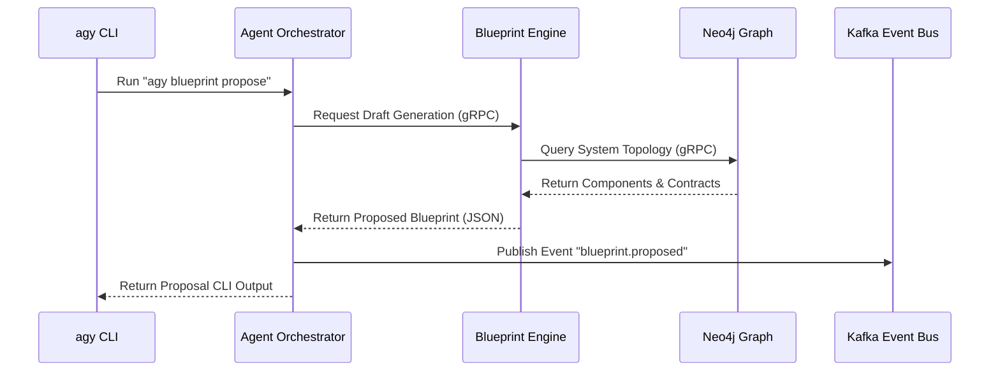

# Atlas Engineering OS — System Architecture

> **Document Status:** Authoritative Reference  
> **Version:** 1.0.0  
> **Last Updated:** 2026-07-06  
> **Owner:** Atlas Architecture Team  

---

## 1. Executive Summary

Atlas is a multi-agent, engine-driven Engineering Operating System. Unlike traditional software development platforms, Atlas does not just compile code; it orchestrates development lifecycle phases (Discovery, Blueprint, Build, Audit, Evolve) under strict constitutional governance.

The architecture is designed for:
- **Resilience:** Domain-isolated engines communicating via a high-performance event bus.
- **Traceability:** Full lineage tracking from high-level stakeholder intent to running container code.
- **Determinism:** A strict governance loop where no action violates defined system invariants.

---

## 2. System Topology & Layers

The system is organized into five functional layers, each with distinct responsibilities and boundaries:

```
┌─────────────────────────────────────────────────────────────────┐
│                     1. HUMAN INTERFACE LAYER                    │
│   CLI (agy)  │  IDE Plugins (VS Code, Cursor)  │  Web Dashboard   │
└────────────────────────────────┬────────────────────────────────┘
                                 │ REST / GraphQL / gRPC
                                 ▼
┌─────────────────────────────────────────────────────────────────┐
│              2. ORCHESTRATION & GOVERNANCE LAYER                │
│       Agent Orchestrator (LangGraph Core) │ Policy Engine       │
└────────────────────────────────┬────────────────────────────────┘
                                 │ Event Bus (Kafka) / RPC
                                 ▼
┌─────────────────────────────────────────────────────────────────┐
│                      3. INTELLIGENCE LAYER                      │
│   Blueprint Engine │ Research Engine │ Decision Engine │ ...    │
└────────────────────────────────┬────────────────────────────────┘
                                 │ Internal DB / Neo4j API
                                 ▼
┌─────────────────────────────────────────────────────────────────┐
│                       4. KNOWLEDGE LAYER                        │
│   Project Memory Engine │ Knowledge Graph (Neo4j) │ Vector DB   │
└────────────────────────────────┬────────────────────────────────┘
                                 │
                                 ▼
┌─────────────────────────────────────────────────────────────────┐
│                      5. FOUNDATION LAYER                        │
│   Vision │ Manifesto │ Constitution │ Principles │ Values       │
└─────────────────────────────────────────────────────────────────┘
```

### 2.1 Human Interface Layer
Provides human-interactive boundaries. The main interfaces are:
- **CLI (`agy`):** A Rust-based terminal tool that acts as the primary developer gateway.
- **IDE Plugins:** Extensions for VS Code, Cursor, and JetBrains that overlay real-time architectural scores, ADR alerts, and requirement intake dialogues inside the editor.
- **Web Dashboard:** A React/Next.js dashboard for visualizing project health, the Engineering Score, dependency drift, and interactive requirement graphs.

### 2.2 Orchestration & Governance Layer
The runtime engine of the OS.
- **Agent Orchestrator:** Implemented via LangGraph, managing stateful, multi-agent workflows. It coordinates tasks among the 18 specialized agents.
- **Policy Engine:** Enforces that all execution commands comply with the project's Constitution. Acts as a gatekeeper before any code is written to disk or pushed to repositories.

### 2.3 Intelligence Layer
Comprises the 15 core engines (Research, Blueprint, Constitution, Memory, Graph, Decision, Prompt, Skill, MCP, Planning, Simulation, Red Team, Audit, Score, Evolution). Each engine is isolated as a microservice written in TypeScript or Python, exposing gRPC and REST interfaces.

### 2.4 Knowledge Layer
Houses the persistent state of Atlas.
- **Knowledge Graph (Neo4j):** Stores the relational topology of the project (requirements connected to components, which are connected to tests, which are connected to ADRs).
- **Vector Database (Qdrant):** Stores semantic embeddings of code blocks, documentation, papers, and conversation transcripts for retrieval.
- **Relational Store (PostgreSQL):** Manages organizations, user records, job logs, and agent execution states.

### 2.5 Foundation Layer
The philosophical and governance kernel of Atlas. It defines system invariants, values, and guidelines that all components, agents, and engines must respect.

---

## 3. Communication Patterns & Data Flows

Atlas implements a hybrid communication architecture to balance low latency with high-throughput event processing:

### 3.1 Synchronous Communication (Command Path)
- **gRPC:** Used for internal, high-throughput, low-latency communication between engines (e.g., Blueprint Engine querying the Knowledge Graph Engine).
- **GraphQL:** Exposed to the Web Dashboard for rich, complex queries of the project structure and graph topologies.
- **REST APIs:** Used for developer onboarding, CLI integration, and webhook management.

### 3.2 Asynchronous Communication (Event Path)
- **Apache Kafka:** The backbone of Atlas engine communication. Every state change, agent action, audit result, and requirements update is published as an event.
- **Topics Schema:** Governed by strict Protocol Buffers (Protobuf) contracts.
- **Event Sourcing:** The Project Memory Engine reconstructs the history of the codebase by replaying event logs.



---

## 4. Key Architectural Patterns

Atlas incorporates several architectural patterns to preserve code quality and maintainability over a 10-year horizon:

1. **Constitutional Enforcement Filters:** Every agent action is wrapped in a middleware decorator that validates output against the project Constitution.
2. **Read-Through Graph Caching:** To minimize database latency, graph traversals are cached using Redis, with cache-invalidation hooks tied to Kafka event topics.
3. **Drift Detection Loop:** A continuous daemon compares the AST of the codebase with the schema contracts in the Blueprint. When drift is detected, a Kafka event is fired to trigger an automatic Audit Engine re-run.

---

## 5. Security & Isolation Architecture

Atlas handles highly sensitive project configurations and source code. Security is designed at every level:
- **Sandbox Execution:** Code execution, testing, and simulations are run inside isolated, ephemeral gVisor runtimes to prevent malicious scripts from escaping.
- **Credential Segregation:** All OAuth tokens (like GitHub, GitLab, Slack) are encrypted using AWS KMS/HashiCorp Vault and never exposed directly to agents.
- **Mutual TLS (mTLS):** All internal microservices communicate using Istio-enforced mTLS in Kubernetes.
