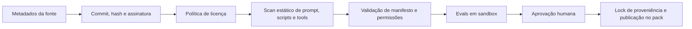

# Atlas Skills Landscape

Pesquisa concluída em 13 de julho de 2026. O objetivo não é transformar o Atlas em um agregador indiscriminado de prompts, mas selecionar padrões comprovados e distribuí-los como capacidades governadas, com contexto seletivo, proveniência, permissões e avaliação.

## Resumo executivo

- Foram avaliadas 50 skills, servidores MCP e workflows mantidos por organizações ou autores reconhecidos.
- A recomendação é consolidar o valor em **15 skills Atlas**, expostas pelo runtime `@atlas/skill` e agrupadas em packs, em vez de instalar 50 dependências concorrentes.
- A maior oportunidade está em quatro blocos: engenharia guiada por especificação, verificação/testes, frontend e browser QA, e segurança/admissão de extensões.
- Integrações com GitHub, Playwright, Sonar, Sentry, Grafana, Figma, Linear e ferramentas de nuvem devem ser **Adapters** com escopo mínimo, leitura por padrão e aprovação explícita para escrita.
- Conteúdo upstream não deve ser carregado remotamente durante a execução. O Atlas deve fixar versão, commit e hash, registrar licença e manter uma cópia revisada ou uma adaptação própria.
- Cinco candidatos são recomendados apenas como inspiração, sobretudo por sobreposição, modelo operacional inadequado ou restrições de licença. Nenhum candidato inseguro entra no top 50; classes rejeitadas estão documentadas separadamente.

### Distribuição das recomendações

| Classe | Quantidade | Significado no Atlas |
|---|---:|---|
| Core | 20 | Padrão comportamental absorvido e mantido pelo Atlas no pack principal ou em um perfil oficial. |
| Adapter | 15 | Integração com ferramenta externa, isolada por permissões e normalmente desativada até ser configurada. |
| Optional Pack | 10 | Capacidade de domínio ou provedor instalada separadamente. |
| Inspiration Only | 5 | Fonte de padrões; não deve ser distribuída literalmente ou acionada como dependência. |
| Rejected | 0 no ranking | Nenhum item classificado assim foi mantido entre os 50; os critérios de rejeição aparecem adiante. |

## Critérios usados

Os itens foram pontuados por utilidade transversal, compatibilidade com o modelo `SKILL.md`/MCP, manutenção, qualidade da documentação, licença, segurança operacional, possibilidade de avaliação automatizada e aderência ao Blueprint, Constituição, memória e trilha de auditoria do Atlas.

As estrelas, releases e datas citadas são sinais observados na data da pesquisa, não garantias de qualidade. Para distribuição, o Atlas deve depender de versão e hash fixos, nunca de popularidade ou de `latest`.

## Ranking das 50 melhores fontes de capacidade

Cada recomendação abaixo registra a fonte, o formato, a função, sinais de qualidade, riscos e a adaptação sugerida. `Core` significa absorver o padrão em implementação própria do Atlas; não significa copiar código ou texto sem respeitar a licença.

| # | Skill/fonte e categoria | Formato e função | Sinais de qualidade/manutenção | Riscos e licença | Recomendação para o Atlas |
|---:|---|---|---|---|---|
| 1 | [Spec-driven Development](https://github.com/addyosmani/agent-skills/tree/main/skills/spec-driven-development) — Arquitetura/planejamento | `SKILL.md`; transforma intenção em PRD, critérios e especificação implementável. | Repositório MIT, cerca de 77 mil estrelas, 347 commits e release 0.6.4 em 12/07/2026. | Pode duplicar o Blueprint e gerar documentação excessiva. | **Core** — fundir ao Discovery e Blueprint, preservando locks, critérios e decisões. |
| 2 | [Source-driven Development](https://github.com/addyosmani/agent-skills/tree/main/skills/source-driven-development) — Pesquisa/documentação | `SKILL.md`; exige fontes oficiais, evidências e citações antes de implementar. | Mesma coleção madura e multiplataforma de Addy Osmani. | Fontes remotas podem mudar ou conter prompt injection. | **Core** — grounding com snapshot, hash, confiança e política de fontes. |
| 3 | [Verification Before Completion](https://github.com/obra/superpowers/tree/main/skills/verification-before-completion) — QA | Workflow `SKILL.md`; impede declarar sucesso sem evidência executada. | Superpowers MIT, cerca de 254 mil estrelas e harness de avaliação de comportamento. | Framework completo é opinativo e pode conflitar com o orquestrador. | **Core** — incorporar o contrato de evidência, sem depender do framework completo. |
| 4 | [Systematic Debugging](https://github.com/obra/superpowers/tree/main/skills/systematic-debugging) — Debugging | Workflow de reprodução, hipótese, isolamento, correção e regressão. | Coleção amplamente usada e acompanhada por testes de skills. | Pode ficar lento em falhas triviais se aplicado sem roteamento. | **Core** — usar níveis de rigor definidos pelo risco e pelo Blueprint. |
| 5 | [Test-driven Development](https://github.com/obra/superpowers/tree/main/skills/test-driven-development) — Testes | Workflow red/green/refactor com proteção contra testes pós-hoc. | MIT; skill conhecida e independente de linguagem. | TDD rígido não serve para todo spike, migração ou código gerado. | **Core** — política adaptativa por tipo de tarefa, com exceções auditadas. |
| 6 | [API and Interface Design](https://github.com/addyosmani/agent-skills/tree/main/skills/api-and-interface-design) — Backend/APIs | Design contract-first para APIs e interfaces públicas. | Coleção MIT, recente e compatível com vários agentes. | Pode produzir contratos sem validar consumidores reais. | **Core** — contratos versionados, compatibilidade e testes de consumidor. |
| 7 | [Code Review and Quality](https://github.com/addyosmani/agent-skills/tree/main/skills/code-review-and-quality) — Qualidade | Checklist e workflow de revisão priorizada por impacto. | Mantido junto a 24 skills de engenharia e documentação clara. | Sobrepõe Sonar, CodeQL e revisão humana; risco de ruído. | **Core** — revisão semântica Atlas que agrega, deduplica e prioriza achados. |
| 8 | [Context Engineering](https://github.com/addyosmani/agent-skills/tree/main/skills/context-engineering) — Agentes | Seleção, compressão e organização de contexto para agentes. | Coleção recente, MIT e desenhada para múltiplas superfícies. | Contexto excessivo aumenta custo e instruções conflitantes. | **Core** — base do roteador seletivo do `@atlas/skill`. |
| 9 | [Semgrep Code Security](https://www.skills.sh/semgrep/skills/code-security) — Segurança | Skill gerada a partir de regras Semgrep para detecção e correção. | [Repositório oficial](https://github.com/semgrep/skills), beta, regras amplamente usadas e 59 commits observados. | Semgrep Rules License v1.0 não é licença open source padrão; resultados podem ter falso positivo. | **Inspiration Only** — consumir IDs/resultados via adapter; não vendorizar texto/regras sem revisão jurídica. |
| 10 | [OWASP ASVS](https://github.com/OWASP/ASVS) — Segurança | Baseline verificável de requisitos de segurança de aplicações. | OWASP, versão estável 5.0.0, comunidade ampla e estrutura rastreável. | CC-BY-SA-4.0 exige atribuição e pode impor share-alike a adaptações. | **Core** — mapear IDs ASVS para controles Atlas, mantendo atribuição e fronteira de licença. |
| 11 | [Playwright MCP](https://github.com/microsoft/playwright-mcp) — Testes/E2E | MCP de automação de browser por acessibilidade, navegação e interação. | Projeto oficial Microsoft, ativo e integrado aos principais agentes. | Browser pode exfiltrar dados, clicar em ações irreversíveis ou atravessar origens. | **Adapter** — perfil isolado, allowlist de hosts, storage efêmero e aprovação para efeitos externos. |
| 12 | [Chrome DevTools MCP](https://github.com/ChromeDevTools/chrome-devtools-mcp) — Performance/debug web | MCP para DOM, console, rede, performance e DevTools. | Apache-2.0, cerca de 43 mil estrelas, 53 releases e release 1.2.0 em 08/06/2026. | Telemetria é habilitada por padrão; conexão a sessões autenticadas expõe dados. | **Adapter** — modo `slim`, isolado/headless e telemetria desabilitada por política. |
| 13 | [Vercel React Best Practices](https://www.skills.sh/vercel-labs/agent-skills/vercel-react-best-practices) — Frontend | 70 regras em oito categorias para React/Next.js e performance. | [Repositório MIT oficial](https://github.com/vercel-labs/agent-skills), cerca de 29 mil estrelas; skill com ampla adoção e auditoria pública. | Regras são específicas do ecossistema Vercel e podem envelhecer. | **Core** — perfil web/Next versionado, com regras ligadas ao stack detectado. |
| 14 | [Web Design Guidelines](https://www.skills.sh/vercel-labs/agent-skills/web-design-guidelines) — UI/UX | Auditoria de acessibilidade, UX e qualidade visual. | Mantida no repositório oficial e listada na [documentação de skills da Vercel](https://vercel.com/docs/agent-resources/skills). | A versão upstream busca regras remotas durante a revisão, criando drift e risco de supply chain. | **Core** — snapshot revisado; proibir fetch de instruções mutáveis em runtime. |
| 15 | [Supabase Postgres Best Practices](https://www.skills.sh/supabase/agent-skills/supabase-postgres-best-practices) — Banco de dados | Boas práticas de schema, índices, RLS, concorrência e monitoramento. | [Repositório MIT oficial](https://github.com/supabase/agent-skills), cerca de 2,3 mil estrelas e 85 commits. | Sugestões dependem de volume e workload; SQL incorreto pode causar perda ou lock. | **Core** — pack PostgreSQL com EXPLAIN, migração reversível e aprovação de escrita. |
| 16 | [Supabase MCP](https://supabase.com/docs/guides/ai-tools/mcp) — Backend/DB | MCP oficial para operar projetos, schema e dados Supabase. | Documentação oficial e integração direta com a plataforma. | Credenciais permitem acesso amplo; escrita em produção é crítica. | **Adapter** — projeto fixo, read-only por padrão, branch de desenvolvimento e gate para DDL/DML. |
| 17 | [Snyk Agent Scan](https://github.com/snyk/agent-scan) — Segurança de agentes | Scanner de skills, prompts, MCPs, tool poisoning e fluxos tóxicos. | Apache-2.0, cerca de 2,8 mil estrelas, checksums assinados e foco específico em agentes. | Escanear configuração MCP pode iniciar comandos stdio; API pode receber metadados da extensão. | **Adapter** — admissão estática/offline primeiro; execução e envio externo somente com consentimento. |
| 18 | [SonarQube MCP Server](https://github.com/SonarSource/sonarqube-mcp-server) — Qualidade/segurança | MCP para issues, hotspots, cobertura e quality gates Sonar. | Projeto oficial SonarSource, ativo, com modo read-only e toolsets configuráveis. | Pode expor código/achados; recursos dependem do produto/licença Sonar. | **Adapter** — leitura por padrão e normalização dos achados no Engineering Score. |
| 19 | [CodeQL Action](https://github.com/github/codeql-action) — SAST/CI | Action oficial de análise semântica de segurança no GitHub. | MIT para a Action, major atual v4 e manutenção oficial GitHub. | Uso de CodeQL em repositórios privados depende dos termos/licença do GitHub Advanced Security. | **Adapter** — gate CI no GitHub pack; verificar entitlement e importar SARIF sem duplicar achados. |
| 20 | [GitHub MCP Server](https://github.com/github/github-mcp-server) — Repositório/entrega | MCP para código, PRs, issues, reviews e workflows. | MIT, cerca de 31 mil estrelas, 70 releases e release 1.5.0 em 27/06/2026. | Token amplo pode alterar código, secrets e pipelines. | **Adapter** — fine-grained token, tools selecionadas e aprovação separada para push/merge/workflow. |
| 21 | [Anthropic MCP Builder](https://github.com/anthropics/skills/tree/main/skills/mcp-builder) — Tooling/agentes | Guia para desenhar servidores MCP úteis e seguros. | [Coleção oficial Anthropic](https://github.com/anthropics/skills), cerca de 161 mil estrelas e especificação Agent Skills. | Pode se sobrepor ao RFC de plugins; licença deve ser verificada por diretório. | **Core** — absorver critérios de ergonomia de tools no SDK/RFC do Atlas, mantendo implementação própria. |
| 22 | [Postman MCP Server](https://learning.postman.com/docs/reference/postman-api/postman-mcp-server/overview/) — APIs/testes | MCP oficial para desenhar, documentar, testar e gerenciar APIs. | Documentação oficial, opção hospedada ou local e integração com workspaces Postman. | API key e collections podem conter segredos; operações escrevem no workspace. | **Adapter** — workspace/collection allowlist, sanitização de secrets e preview de mutações. |
| 23 | [Anthropic Webapp Testing](https://github.com/anthropics/skills/tree/main/skills/webapp-testing) — Testes web | Workflow Playwright para explorar e validar webapps. | Skill oficial, exemplos claros e integração com browser automation. | Duplica Playwright MCP e pode divergir do runner de testes do projeto. | **Inspiration Only** — fundir os cenários úteis na skill Atlas Browser QA. |
| 24 | [Vercel Composition Patterns](https://www.skills.sh/vercel-labs/agent-skills/vercel-composition-patterns) — Frontend/arquitetura | Padrões de composição React para APIs de componentes escaláveis. | MIT, coleção oficial Vercel e compatível com 18+ agentes. | Aplicação indiscriminada aumenta abstração e complexidade. | **Core** — perfil React, acionado somente em componentes com sinais de prop explosion/reuso. |
| 25 | [Anthropic Frontend Design](https://github.com/anthropics/skills/tree/main/skills/frontend-design) — UI | Orientação para criar interfaces com identidade visual e acabamento. | Skill oficial muito difundida, com exemplos e workflow claro. | Critérios subjetivos; risco de conflito com design system existente e licença por pasta. | **Inspiration Only** — incorporar princípios não conflitantes; design system e tokens locais têm precedência. |
| 26 | [Vercel Before and After](https://vercel.com/docs/agent-resources/skills) — QA visual | Workflow de captura e comparação visual antes/depois de mudanças. | Skill oficial listada pela Vercel, integrada ao ecossistema browser. | Screenshots podem conter PII; diffs são instáveis sem viewport/fontes fixas. | **Optional Pack** — baseline versionado, mascaramento e tolerância de pixel/estrutura. |
| 27 | [Performance Optimization](https://github.com/addyosmani/agent-skills/tree/main/skills/performance-optimization) — Performance | Workflow de medir, localizar gargalo, otimizar e comprovar ganho. | MIT, mantido por referência reconhecida em performance web. | Otimização prematura e benchmark não representativo. | **Core** — exigir baseline, orçamento e evidência comparável. |
| 28 | [CI/CD and Automation](https://github.com/addyosmani/agent-skills/tree/main/skills/ci-cd-and-automation) — DevOps | Desenho de pipelines, gates, rollback e automação. | Coleção madura, recente e multiplataforma. | Pipeline pode vazar secrets ou publicar artefatos sem autorização. | **Core** — planejamento de pipeline com dry-run; escrita/deploy ficam em adapters aprovados. |
| 29 | [Terraform MCP Server](https://github.com/hashicorp/terraform-mcp-server) — IaC/cloud | MCP oficial para Registry, HCP Terraform e operações Terraform. | HashiCorp, cerca de 354 commits; operações ficam desabilitadas por padrão. | A própria documentação alerta para uso local; `plan/apply` pode alterar infraestrutura. | **Optional Pack** — operações desligadas por padrão, workspace fixo, plan assinado e aprovação de apply. |
| 30 | [Kubernetes MCP Server](https://github.com/containers/kubernetes-mcp-server) — Plataforma | MCP direto à API Kubernetes, multi-cluster, testes e OTel. | Apache-2.0, cerca de 1,6 mil estrelas e 62 releases; release em 05/05/2026. | Delete/exec/secrets e contexto de cluster errado têm alto impacto. | **Optional Pack** — namespace/RBAC mínimo, leitura por padrão e dupla aprovação em produção. |
| 31 | [Docker MCP Toolkit](https://docs.docker.com/ai/mcp-catalog-and-toolkit/toolkit/) — Tooling/sandbox | Catálogo e runtime para configurar servidores MCP e OAuth. | Produto oficial Docker, útil para isolamento e distribuição. | Não é conhecimento de engenharia por si; catálogo amplia supply chain e superfície de ataque. | **Inspiration Only** — aproveitar isolamento/consentimento como referência, sem torná-lo runtime obrigatório. |
| 32 | [AWS Agent Skills](https://docs.aws.amazon.com/agent-toolkit/latest/userguide/skills.html) — Cloud AWS | Pacotes `SKILL.md`, descoberta progressiva, CLI/MCP e contexto IAM. | Documentação e [toolkit oficiais](https://github.com/awslabs/agent-toolkit-for-aws), padrão aberto e manutenção AWS. | Alto lock-in; scripts e credenciais podem operar recursos caros ou destrutivos. | **Optional Pack** — `@atlas/pack-cloud-aws`, read-only/dry-run e políticas IAM explícitas. |
| 33 | [Microsoft Azure Agent Skills](https://github.com/MicrosoftDocs/Agent-Skills) — Cloud Azure | Cerca de 193 skills oficiais por serviço, compatíveis com Codex e outros agentes. | Repositório Microsoft, documentação oficial e cobertura ampla por categorias. | Volume grande causa conflito/context bloat; comandos podem criar recursos. | **Optional Pack** — índice seletivo por serviço, versão fixada e permissões por tool. |
| 34 | [Cloudflare Skills](https://github.com/cloudflare/skills) — Edge/cloud | Skills para Workers, Pages, KV, D1, R2, AI e IaC. | Repositório oficial e compatibilidade declarada com Codex. | Específico do provedor; deploy e storage geram efeitos externos. | **Optional Pack** — `@atlas/pack-cloud-cloudflare`, somente após detecção do stack. |
| 35 | [Google Cloud MCP](https://github.com/google/mcp) — Cloud GCP | Servidores e exemplos MCP para serviços Google Cloud. | Apache-2.0, cerca de 4,1 mil estrelas e manutenção Google. | O próprio repositório informa que os exemplos não são produto oficialmente suportado; IAM e custos. | **Optional Pack** — priorizar serviços remotos gerenciados e exigir projeto/região explícitos. |
| 36 | [MCP Toolbox for Databases](https://github.com/googleapis/mcp-toolbox) — Banco de dados | Toolbox para Postgres, MySQL, SQL Server, Oracle, MongoDB, Redis, Snowflake e outros. | Projeto Google APIs, cerca de 1.895 commits e cobertura extensa. | Query arbitrária causa exfiltração ou escrita; conectores variam em maturidade. | **Optional Pack** — tools de consulta allowlisted, credenciais read-only e limite/timeout obrigatório. |
| 37 | [dbt MCP](https://github.com/dbt-labs/dbt-mcp) — Analytics/data | MCP para projeto dbt, documentação, semantic layer e consultas. | Apache-2.0, cerca de 559 estrelas, 68 releases e release 1.18 em 08/05/2026. | Pode executar consultas caras e expor métricas/dados. | **Optional Pack** — separar metadata/lineage de execução; custos e ambientes governados. |
| 38 | [Sentry MCP](https://github.com/getsentry/sentry-mcp) — Observabilidade | MCP oficial para investigar eventos, issues, releases e debugging. | Mantido pela Sentry e orientado a investigação human-in-the-loop. | Eventos de produção podem conter PII, tokens e payloads sensíveis. | **Adapter** — redaction, projeto/ambiente fixos e leitura por padrão. |
| 39 | [Grafana MCP](https://github.com/grafana/mcp-grafana) — Observabilidade | MCP para dashboards, Prometheus, Loki, alertas e incidentes. | Apache-2.0, cerca de 3,1 mil estrelas, 50 releases e release 0.14 em 08/05/2026. | Logs e métricas podem conter dados sensíveis; queries pesadas afetam backend. | **Adapter** — service account de leitura, limites de janela/cardinalidade e trilha de consulta. |
| 40 | [Microsoft Cloud Solution Architect](https://github.com/microsoft/skills/tree/main/.github/skills/cloud-solution-architect) — Arquitetura | Skill de desenho e avaliação de soluções cloud. | [Repositório Microsoft Skills](https://github.com/microsoft/skills), MIT, cerca de 2,7 mil estrelas, 670 commits e harness de testes. | Enfoque Azure e overlap com packs de cloud; recomendações podem gerar lock-in. | **Inspiration Only** — extrair checklists provider-neutral para arquitetura Atlas. |
| 41 | [Interview Me](https://github.com/addyosmani/agent-skills/tree/main/skills/interview-me) — Discovery/produto | Entrevista estruturada para revelar requisitos, restrições e ambiguidades. | MIT, parte de coleção atual e bem documentada. | Perguntas demais travam tarefas simples; respostas podem conter dados sensíveis. | **Core** — Discovery adaptativo por risco, registrando decisões e desconhecidos. |
| 42 | [Idea Refine](https://github.com/addyosmani/agent-skills/tree/main/skills/idea-refine) — Produto | Refina ideia em problema, usuário, escopo, riscos e hipótese testável. | Mesma coleção madura e multiplataforma. | Pode induzir escopo artificial ou substituir pesquisa real com usuários. | **Core** — entrada opcional do Discovery; distinguir hipótese de evidência. |
| 43 | [Planning and Task Breakdown](https://github.com/addyosmani/agent-skills/tree/main/skills/planning-and-task-breakdown) — Gestão/execução | Decompõe entregas em dependências, etapas verificáveis e critérios. | MIT, atualizado junto à coleção e aplicável a qualquer stack. | Microtarefas demais aumentam overhead; paralelismo pode criar conflitos. | **Core** — alimentar o orchestrator com ownership, dependências e zonas de escrita. |
| 44 | [Anthropic Doc Coauthoring](https://github.com/anthropics/skills/tree/main/skills/doc-coauthoring) — Documentação | Workflow iterativo para estruturar, revisar e validar documentos. | Skill oficial, reutilizável e orientada a contexto do leitor. | Licença deve ser verificada por diretório; não substitui fonte de verdade do projeto. | **Core** — documentos vivos derivados de Blueprint/ADR, com validação de links e drift. |
| 45 | [Context7](https://github.com/upstash/context7) — Pesquisa técnica | MCP de documentação atualizada e exemplos de bibliotecas por versão. | MIT, cerca de 59 mil estrelas, 896 commits, 93 releases e release em 06/07/2026. | Conteúdo remoto pode estar incorreto/malicioso; queries podem revelar contexto do projeto. | **Adapter** — lookup somente quando necessário, domínio/versão registrados e citações no audit log. |
| 46 | [Hugging Face Agent Skills](https://github.com/huggingface/skills) — ML/data | Skills para Hub, datasets, avaliação e treinamento de modelos. | Apache-2.0, cerca de 10,8 mil estrelas e 324 commits; [documentação oficial](https://huggingface.co/docs/hub/en/agents-skills). | Upload acidental de dados, custo computacional e modelos/licenças heterogêneos. | **Optional Pack** — perfis separados para dataset/eval/train, com política de dados e orçamento. |
| 47 | [Figma MCP Server](https://developers.figma.com/docs/figma-mcp-server/) — Design/UX | MCP oficial para ler contexto de design e, em beta, escrever no canvas. | Documentação oficial; servidor remoto recomendado e integração code-to-design. | Beta, possível cobrança por uso e acesso a arquivos proprietários; escrita pode alterar design compartilhado. | **Adapter** — leitura primeiro, file/node scope e preview/aprovação para escrita. |
| 48 | [Linear MCP Server](https://linear.app/docs/mcp) — Gestão de projeto | MCP OAuth 2.1 para issues, projetos, comentários e planejamento. | Serviço oficial hospedado, documentação específica para Codex. | Pode notificar pessoas ou alterar estado/prioridade. | **Adapter** — leitura/sync por padrão; preview e confirmação para comentários/mutações em lote. |
| 49 | [Atlassian Rovo MCP](https://developer.atlassian.com/cloud/rovo-mcp/) — Projeto/conhecimento | MCP OAuth 2.1 para Jira, Confluence, Compass, JSM e Bitbucket. | Serviço oficial Atlassian, respeita permissões existentes e cobre vários produtos. | Dados corporativos amplos; rate limits; documentação indica limitações para FedRAMP/HIPAA. | **Adapter** — sites/projetos allowlisted, escopo mínimo e bloqueio em ambientes regulados incompatíveis. |
| 50 | [Notion MCP](https://developers.notion.com/guides/mcp/overview) — Documentação/projeto | MCP hospedado para consultar e atualizar páginas, tarefas e relatórios. | Serviço oficial OAuth e documentação de integração. | Conexão pode expor workspace amplo; escrita afeta documentos compartilhados. | **Adapter** — roots explícitas, leitura por padrão e diff antes de publicar. |

## Shortlist: 15 skills que o Atlas deveria oferecer

Essas são capacidades Atlas, não simples aliases para o upstream. Cada uma deve ter contrato, avaliação e política próprias.

| Prioridade | Skill Atlas | Consolida | Distribuição sugerida |
|---:|---|---|---|
| 1 | `atlas.discovery` | Interview Me, Idea Refine, Spec-driven Development e Blueprint | `@atlas/pack-core` |
| 2 | `atlas.context-grounding` | Source-driven Development, Context Engineering e adapter Context7 | `@atlas/pack-core` |
| 3 | `atlas.planning` | Task Breakdown, locks do Blueprint, dependências e zonas de escrita | `@atlas/pack-core` |
| 4 | `atlas.implementation` | TDD adaptativo, entrega incremental e contrato de evidência | `@atlas/pack-core` |
| 5 | `atlas.debugging` | Systematic Debugging e Verification Before Completion | `@atlas/pack-core` |
| 6 | `atlas.review` | Code Review, performance, Engineering Score e deduplicação de SAST | `@atlas/pack-core` |
| 7 | `atlas.api-contracts` | API/interface design, OpenAPI, testes de consumidor e Postman adapter | `@atlas/pack-backend` |
| 8 | `atlas.ui-web` | React best practices, composition, acessibilidade e design guidelines | `@atlas/pack-web` |
| 9 | `atlas.browser-qa` | Playwright, webapp testing, visual diff e DevTools opcional | `@atlas/pack-web` |
| 10 | `atlas.security` | ASVS, Semgrep/CodeQL/Sonar adapters e admissão de supply chain | `@atlas/pack-security` |
| 11 | `atlas.data-postgres` | Postgres/Supabase, RLS, índices, migração e query evidence | `@atlas/pack-data-postgres` |
| 12 | `atlas.delivery` | CI/CD, GitHub adapter, rollback e aprovação de deploy | `@atlas/pack-delivery` |
| 13 | `atlas.observability` | Sentry/Grafana, investigação de incidentes e evidência operacional | `@atlas/pack-observability` |
| 14 | `atlas.living-docs` | Doc coauthoring, ADR/memória e adapters Notion/Linear/Atlassian | `@atlas/pack-product-sync` |
| 15 | `atlas.cloud` | Router provider-neutral e packs AWS/Azure/GCP/Cloudflare/Terraform/K8s | `@atlas/pack-cloud-*` |

### O papel do `@atlas/skill`

`@atlas/skill` deve ser o runtime/SDK e resolver uma skill por intenção, risco e stack. Não deve despejar todas as instruções no prompt.

1. O agente recebe somente o índice compacto: id, descrição, gatilhos, exclusões e custo estimado.
2. O roteador escolhe uma skill e carrega seu `SKILL.md` somente quando a intenção corresponder.
3. Referências adicionais são carregadas uma a uma, conforme a etapa; scripts e MCPs permanecem desligados.
4. Antes de disponibilizar uma tool, o Atlas negocia permissões, ambiente, modo read-only e aprovações.
5. A saída deve incluir evidência, proveniência, decisões e atualização da memória/Blueprint quando aplicável.

Estrutura sugerida:

```text
@atlas/skill
  runtime de descoberta, roteamento, política e evidência

@atlas/pack-core
  discovery, grounding, planning, implementation, debugging, review

@atlas/pack-web
  ui-web, browser-qa

@atlas/pack-security
  security + adapters selecionáveis

@atlas/pack-cloud-aws | azure | gcp | cloudflare
  somente o índice do provedor instalado; serviço carregado sob demanda
```

## Consolidações e sobreposições

Instalar os upstreams lado a lado criaria comandos redundantes e instruções conflitantes. As consolidações recomendadas são:

- **Discovery e planejamento:** Interview Me + Idea Refine + Spec-driven + Task Breakdown tornam-se um único fluxo Atlas, variando apenas a profundidade.
- **Execução comprovável:** TDD + Systematic Debugging + Verification Before Completion compartilham um contrato comum de hipótese, comando, resultado e regressão.
- **Frontend:** React Best Practices + Composition Patterns + Web Design Guidelines + Frontend Design viram um perfil web com precedência para tokens/design system locais.
- **Browser QA:** Anthropic Webapp Testing não deve coexistir como segunda orquestração; Playwright é o adapter principal, Chrome DevTools entra apenas em diagnósticos profundos e visual diff é um módulo.
- **Segurança:** OWASP fornece requisitos; Semgrep, CodeQL e Sonar fornecem achados; Snyk Agent Scan protege a própria supply chain. O Atlas normaliza tudo em controles e evidências, removendo duplicatas.
- **Banco de dados:** regras Postgres são o conhecimento; Supabase MCP e MCP Toolbox são adapters, nunca fontes de decisão autônoma.
- **Cloud:** um único `atlas.cloud` decide o perfil correto. AWS, Azure, GCP e Cloudflare não devem carregar contexto simultaneamente.
- **Documentação e gestão:** Doc Coauthoring define o workflow; Linear, Jira/Confluence e Notion são destinos opcionais, não fontes concorrentes de verdade.

## Manifesto e modelo de segurança sugeridos

Cada pacote deve conter `SKILL.md`, `atlas.skill.json`, referências pinadas, avaliações e um lock de proveniência. Campos mínimos do manifesto:

```json
{
  "id": "atlas.browser-qa",
  "version": "1.0.0",
  "source": { "url": "...", "commit": "...", "sha256": "..." },
  "license": "SPDX-or-reviewed-policy-id",
  "triggers": ["validate web flow", "reproduce UI bug"],
  "exclusions": ["production purchase", "unknown external origin"],
  "permissions": {
    "filesystem": "workspace-read",
    "networkOrigins": ["http://localhost:*"],
    "tools": ["playwright.navigate", "playwright.snapshot"],
    "mutability": "read-only"
  },
  "riskTier": "T2",
  "evidence": ["commands", "screenshots", "assertions"],
  "evals": ["routing", "safety", "task-success", "non-regression"]
}
```

### Níveis de risco

| Nível | Exemplo | Política padrão |
|---|---|---|
| T0 | Instrução local, sem tools | Pode executar após roteamento. |
| T1 | Leitura do repositório | Limitado às roots do workspace. |
| T2 | Rede ou serviço externo read-only | Origem/tenant explícitos, redaction e log. |
| T3 | Escrita em serviço ou ambiente não produtivo | Preview/diff e aprovação por operação ou lote. |
| T4 | Produção, destrutivo, secrets ou custo material | Dupla confirmação, escopo temporário, rollback e auditoria completa. |

### Pipeline de admissão



O scan de admissão não deve iniciar automaticamente servidores MCP encontrados em configurações. Skills de instrução e adapters executáveis devem ser artefatos separados.

## O que rejeitar

Mesmo sem manter itens `Rejected` no top 50, o registro do Atlas deve rejeitar automaticamente ou enviar para revisão excepcional:

- mega-packs anônimos, mass-generated ou sem licença, proprietário, histórico e avaliações;
- skill que baixa instruções mutáveis em runtime sem versão, hash e assinatura;
- dependência por `@latest`, branch móvel ou URL encurtada em ambiente de produção;
- shell irrestrito, token cloud/database amplo ou acesso ao diretório pessoal;
- prompt que pede para ignorar a Constituição, gates, escopo ou aprovação humana;
- adapters duplicados sem regra de precedência e sem normalização dos resultados;
- conteúdo source-available ou share-alike vendorado sem cumprimento da licença;
- scanner que inicia servidores, executa scripts ou envia conteúdo a terceiros sem consentimento explícito;
- skill que escreve em produção, publica, compra, remove ou notifica terceiros sem preview e gate T4.

## Sequência prática de implementação

1. Definir o schema `atlas.skill.json`, risk tiers e lock de proveniência.
2. Implementar `@atlas/skill` com índice compacto e carregamento progressivo.
3. Entregar primeiro `atlas.discovery`, `atlas.context-grounding`, `atlas.debugging` e `atlas.review`, pois validam a arquitetura sem exigir credenciais externas.
4. Criar `@atlas/pack-web` e testá-lo no projeto paralelo de controle de estoque: React, acessibilidade, Playwright, visual diff e performance.
5. Adicionar `@atlas/pack-security` e o pipeline de admissão antes de abrir o ecossistema a terceiros.
6. Só então publicar adapters e packs cloud/data/observability, todos opt-in.

## Fontes-base e observações de licença

- [Agent Skills da Vercel](https://github.com/vercel-labs/agent-skills): MIT; regras específicas devem ser pinadas por commit.
- [Anthropic Skills](https://github.com/anthropics/skills): várias skills sob Apache-2.0, mas algumas pastas de criação de documentos têm licença source-available; verificar o arquivo da pasta antes de adaptar.
- [Addy Osmani Agent Skills](https://github.com/addyosmani/agent-skills): MIT.
- [Superpowers](https://github.com/obra/superpowers): MIT; aproveitar skills individuais e evals, não impor a orquestração completa.
- [Microsoft Skills](https://github.com/microsoft/skills): MIT e harness de testes útil como referência.
- [GitHub: About agent skills](https://docs.github.com/en/copilot/concepts/agents/about-agent-skills): referência do padrão aberto e dos escopos de skill.

Licenças precisam ser revalidadas e registradas no commit exato no momento da admissão. Este relatório é uma triagem técnica, não parecer jurídico.
